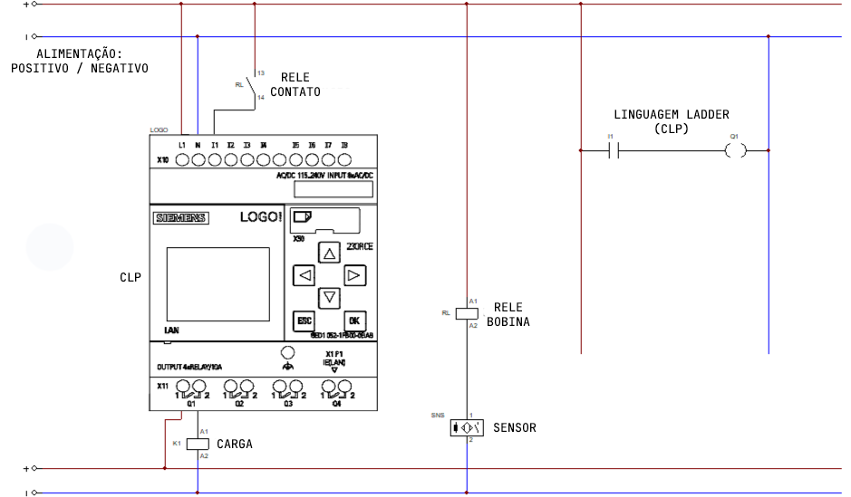

# Projeto de Controle de Robô utilizando Java/Python e Comandos Elétricos

Este projeto foi desenvolvido para treinar lógica de programação utilizando Java/Python em conjunto com comandos elétricos para controle de um robô. Ele utiliza um conjunto de componentes para realizar a comunicação e autorização do robô para operação.

## Componentes do Sistema
### O sistema é composto pelos seguintes elementos:

- SENSOR
- RELE DE INTERFACE
- CLP

### Funcionamento

- SENSOR: Detecta a presença da peça.
- RELE BOBINA: Acionado pelo SENSOR, altera o estado do RELE CONTATO.
- RELE CONTATO: Altera seu estado de acordo com o acionamento da bobina.
- CLP ENTRADA: Recebe o sinal do RELE CONTATO em uma de suas entradas.
- CLP SAÍDA: Informa "Robô autorizado para trabalho!" se todos os componentes estiverem operacionais.

  * Se houver falha em qualquer fase do processo, o CLP informa "Robô não autorizado para trabalho! Algum componente comprometido."

## DIAGRAMA COMANDO ELETRICO

